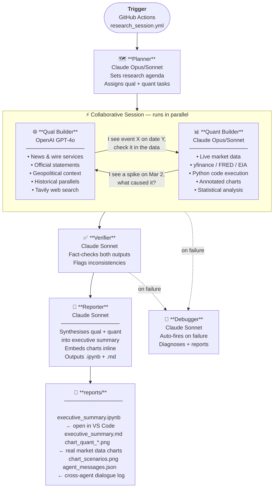

# AgentOrg — System Architecture

## Research Session Flow



---

## Agent Roles

| Agent | Model | Tools | Role |
|---|---|---|---|
| **Planner** | Claude Opus *(premium)* | Web search | Sets research agenda, assigns sections, tracks completion |
| **Qual Builder** | OpenAI GPT-4.5 | Web search (Tavily) | Policy analyst — news, speeches, geopolitical narrative |
| **Quant Builder** | Claude Sonnet | Python exec + Web search | Data scientist — live prices, charts, statistical analysis |
| **Verifier** | Claude Sonnet | Web search | Fact-checker — cross-checks both builders against sources |
| **Reporter** | OpenAI GPT-4.5 | — | Senior editor — synthesises everything into final document |
| **Debugger** | Claude Sonnet | Web search + logs | Auto-fires on failure, diagnoses issues |

---

## Cross-Agent Messaging

Qual and Quant run as **parallel threads** sharing a message bus:

```
Quant: "Brent crude +$20 (8%) between 06:00–10:00 UTC on Mar 2.
        What event caused this spike?"
          ↓
Qual:  "Iran struck Qatar's Ras Laffan LNG terminal at ~08:30 UTC.
        Qatar declared force majeure on all LNG shipments 2hrs later.
        Source: Reuters March 2, 2026 14:22 GMT.
        Also check: LNG futures (NG=F) and Qatar ETF (QAT) same window."
          ↓
Quant: [annotates oil chart with event label, adds LNG panel, checks QAT]
```

The full dialogue is saved to `reports/*_session_dialogue.md` and included in the reporter's synthesis.

---

## Data Sources

| Source | Key Required | Data |
|---|---|---|
| **yfinance** | None | Equities, futures (oil, gold), indices, ETFs, forex |
| **FRED** | `FRED_API_KEY` ✓ | CPI, GDP, Fed funds rate, Treasury yields, macro |
| **EIA** | `EIA_API_KEY` ✓ | Oil/gas inventories, production, Hormuz flows |
| **Tavily** | `TAVILY_API_KEY` ✓ | Real-time web search for both qual and quant |
| **Kalshi** | `KALSHI_API_KEY` ✓ | Prediction market probabilities (future use) |

---

## Workflow Inputs (GitHub Actions)

Trigger **Research Session** from [Actions → Research Session](https://github.com/baileymcintosh/agents/actions/workflows/research_session.yml):

| Input | Options | Effect |
|---|---|---|
| `time_budget` | `30m`, `2h`, `20h` | How long the session runs |
| `model_tier` | `sonnet` (~$1–3) / `opus` (~$7–10) | Claude model quality/cost for planner + quant |
| `collab_turns` | `2`–`5` | Cross-check turns per agent per cycle |
