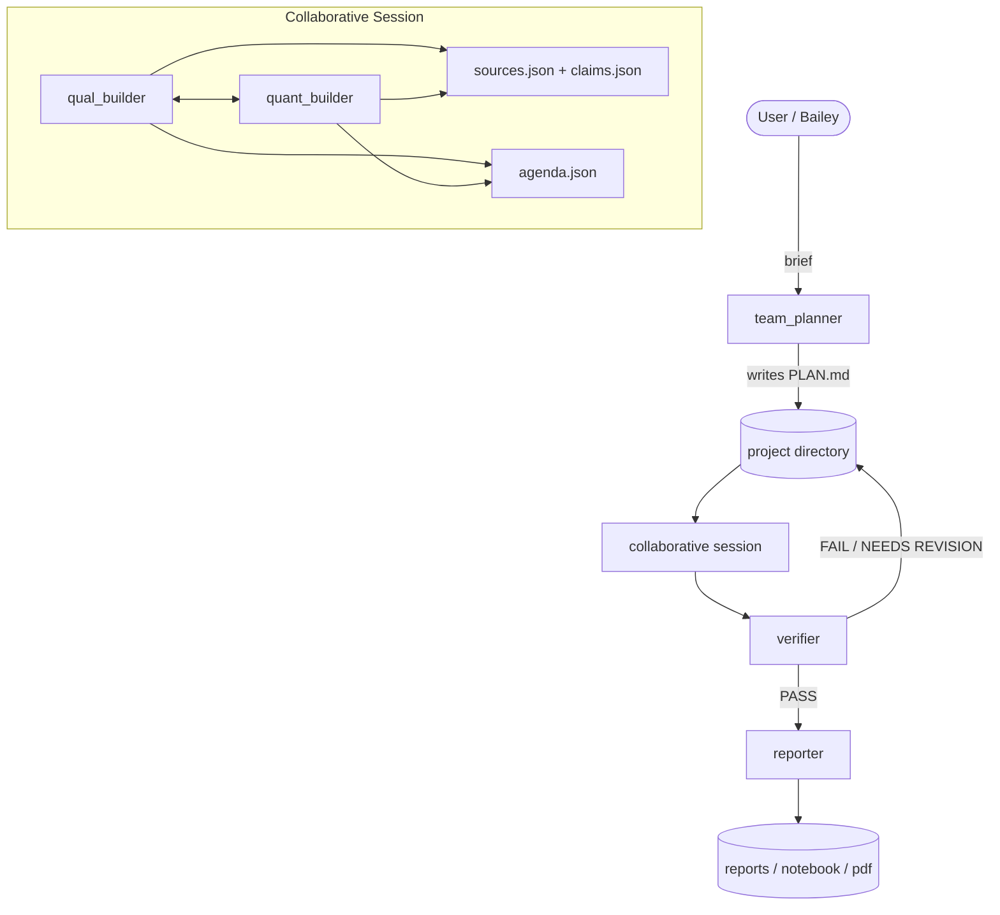

# Architecture

## Canonical Workflow



## Execution Model

- `team_planner` creates the initial agenda and project structure.
- `qual_builder` and `quant_builder` run as the active research pair.
- Both builders emit prose plus a machine-readable `evidence_json` payload.
- The session persists sources, claims, and agenda items under `reports/_state/`.
- `verifier` checks claim provenance and quantitative artifact coverage.
- `reporter` only synthesizes after verifier verdict `PASS`.

## Agent Roles

| Agent | Prelim behavior | Deep behavior | Purpose |
|---|---|---|---|
| `team_planner` | Opus | Opus | Team design, project framing, agenda seeds |
| `qual_builder` | cheaper / fast search | deeper current-intelligence pass | News, policy, speeches, source gathering |
| `quant_builder` | focused data validation | deeper analysis + charts | Data, charts, statistics, quantitative claims |
| `verifier` | fast provenance screen | full claim-level gate | QA over claims, sources, and artifacts |
| `reporter` | concise synthesis | full memo + notebook/PDF | Final reporting |
| `debugger` | recovery | recovery | Failure diagnosis and retry guidance |

## Persisted State

Project reports now include structured state:

```text
reports/
  _state/
    agenda.json
    claims.json
    sources.json
    verification.json
  charts_manifest.json
  *_qual_builder_*.md
  *_quant_builder_*.md
  *_verifier_*.md
  *_reporter_*.md
```

## Verification Rules

The current verifier enforces:

- core claims need at least two corroborating tier 1-3 sources
- claims must have source provenance or quantitative artifacts
- quant claims must carry dataset provenance and/or generated charts
- final reporting is blocked when verification fails

## Notes

- The legacy single `builder` path still exists in the codebase for compatibility, but it is no longer the intended product architecture.
- `charts_manifest.json` remains the reporter-facing chart handoff and should stay decoupled from the broader evidence store.
