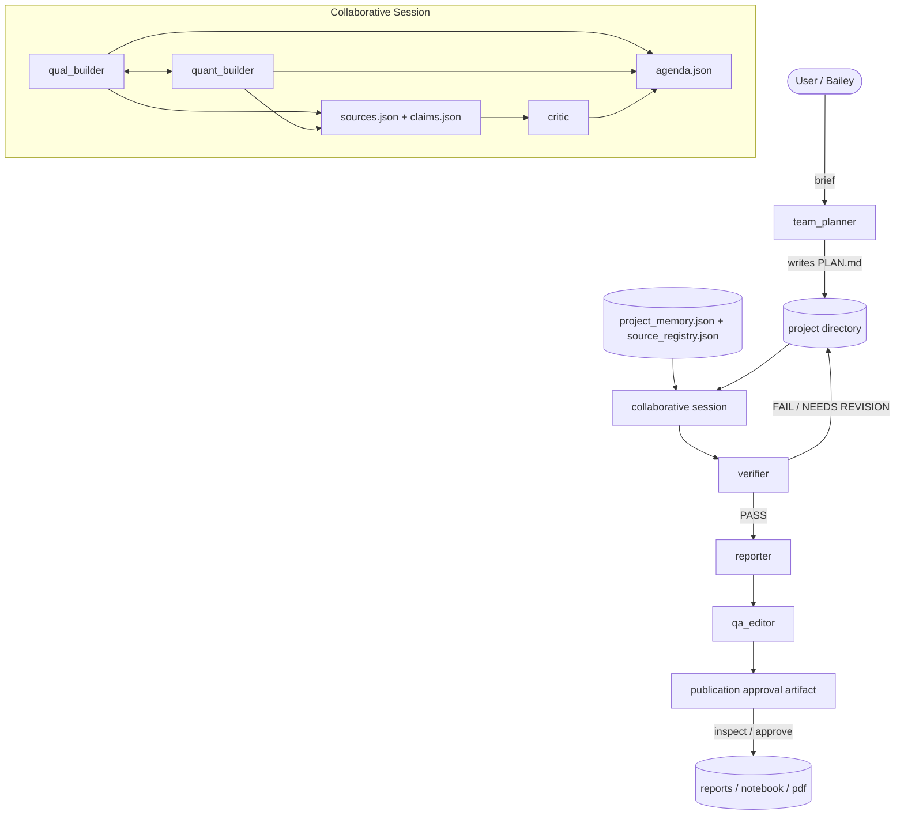

# Architecture

## Canonical Workflow



## Execution Model

- `team_planner` creates the initial agenda and project structure.
- Related `project_memory.json` artifacts can seed carry-forward questions and source hints into the run.
- `qual_builder` and `quant_builder` run as the active research pair.
- At the start of each turn, each builder receives a compact brief of the other builder's top claims and sources from the shared evidence store.
- Both builders emit prose plus a machine-readable `evidence_json` payload.
- In deep mode, `critic` runs once after both builders finish turn 1 and adds high-priority challenge items back into the agenda.
- The session persists sources, claims, and agenda items under `reports/_state/`, and agenda items now carry rough difficulty tags.
- `verifier` checks claim provenance and quantitative artifact coverage.
- `reporter` only synthesizes after verifier verdict `PASS`, injects inline source tags where possible, and appends a references section from `sources.json`.
- notebook export embeds charts directly into markdown cells so rendered notebooks do not depend on external chart-file paths.
- `qa_editor` reviews the finished report against the brief, verified claims, charts, and unresolved agenda items; if needed it requests one bounded reporter rewrite.
- `publication approval` persists the publication-boundary state and gives the operator a final inspect/approve step before the push boundary.
- At run end, the system writes `project_memory.json` and updates the shared `source_registry.json`.

## Agent Roles

| Agent | Prelim behavior | Deep behavior | Purpose |
|---|---|---|---|
| `team_planner` | Opus | Opus | Team design, project framing, agenda seeds |
| `qual_builder` | cheaper / fast search | deeper current-intelligence pass | News, policy, speeches, source gathering |
| `quant_builder` | focused data validation | deeper analysis + charts | Data, charts, statistics, quantitative claims |
| `critic` | skipped | adversarial checkpoint after turn 1 | Challenge weak claims, contradictions, and missing counterarguments |
| `verifier` | fast provenance screen | full claim-level gate | QA over claims, sources, and artifacts |
| `reporter` | concise synthesis | full memo + notebook/PDF | Final reporting with evidence-backed citations |
| `qa_editor` | lightweight or skipped by workflow choice | final publication QA | Brief coverage, chart coverage, narrative alignment, formatting |
| `publication approval` | pending | approved | Persisted publish boundary / operator sign-off |
| `project memory` | prior runs reused selectively | prior runs reused selectively | Cross-session retrieval of verified findings, open questions, and source hints |
| `debugger` | recovery | recovery | Failure diagnosis and retry guidance |

## Persisted State

Project reports now include structured state:

```text
reports/
  _state/
    agenda.json
    claims.json
    sources.json
    verification.json
  charts_manifest.json
  *_critic_*.md
  *_qual_builder_*.md
  *_qa_editor_*.md
  *_quant_builder_*.md
  *_verifier_*.md
  *_reporter_*.md
  publication_approval.json
  publication_approval.md
project_memory.json
source_registry.json
```

## Verification Rules

The current verifier enforces:

- core claims need at least two corroborating tier 1-3 sources
- claims must have source provenance or quantitative artifacts
- quant claims must carry dataset provenance and/or generated charts
- final reporting is blocked when verification fails

## Notes

- The legacy single `builder` path still exists in the codebase for compatibility, but it is no longer the intended product architecture.
- `charts_manifest.json` remains the reporter-facing chart handoff and should stay decoupled from the broader evidence store.
- The critic checkpoint is implemented with explicit thread events rather than a hard barrier so the session can degrade cleanly if one worker exits early or errors.
- These root docs are the primary user-facing architecture references and should be updated whenever the execution path changes.
- `agentorg approval` and `agentorg approve` are the user-facing entrypoints for the publication boundary.
- `source_registry.json` currently lives at the projects-root level so related projects can share source reputation without coupling it to this repo's local state.
- Full-article fetching is available through `fetch_url`; plain search snippets are no longer the only browsing primitive.
- PDF and paper ingestion are now available through `fetch_document`; this is the current path for research-document retrieval.
